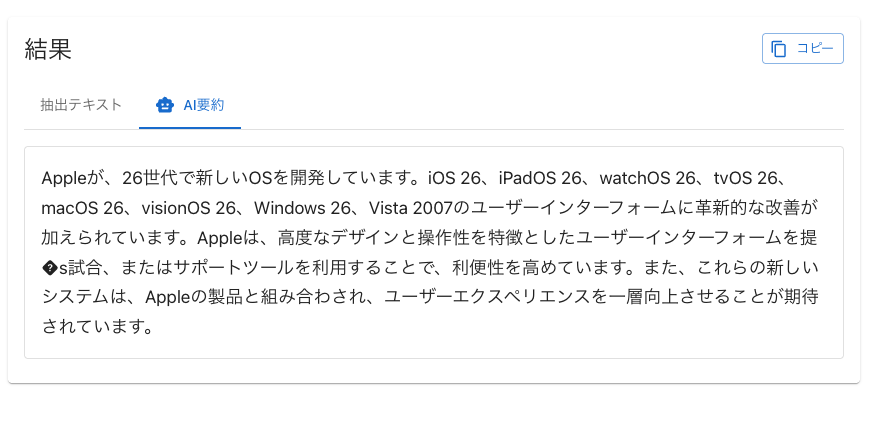
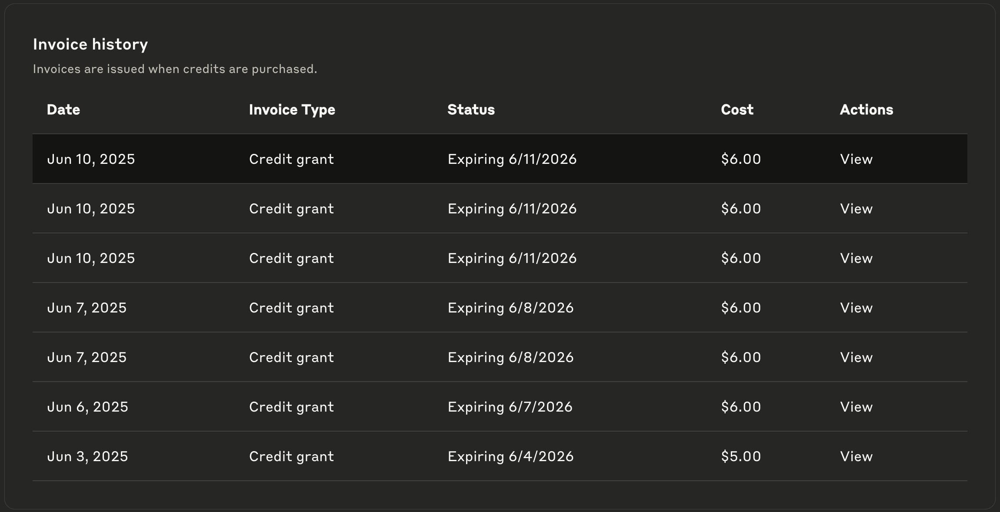

# 📄 WebLLMを利用した日本語テキスト要約

## ブラウザで完結するAI搭載PDF要約ツール

---

## プロフィール


名前: @teitei_tk
趣味: ChatGPTとの議論、漫画を読むこと

---

## この資料について

2025/6/10 現在の情報で話します

---

## モチベーション

- Vibe Codingの題材を探していた
- ClaudeCode(Claude4)の実力を試したかった
- 機密性の高いプロダクトでもAIを使いたい
  - 全てローカルで完結するWebLLMなら利用できるのでは？

---

## ローカルLLMについて

ローカルLLMは、**自分のパソコンや社内サーバーなど、インターネットから隔離されたオフライン環境で実行できる大規模言語モデル（LLM）** のこと

ChatGPTやGeminiのように、サービス提供者のクラウドサーバー上で動作するLLMとは対照的に、手元のコンピュータ上でモデルを直接動かすのが特徴

---

## ローカルLLMのメリット

### プライバシーとセキュリティ 🛡️

入力した情報が外部に送信されないため、機密情報や個人情報を安全に扱える

### オフラインでの利用 ✈️

インターネット接続がなくてもLLMを利用可能。飛行機の中や、ネットワーク環境が不安定な場所でも作業できる

### 高いカスタマイズ性 🔧

モデルの調整（ファインチューニング）や、特定の用途に特化した独自のシステムを構築しやすいのが魅力

---

## ローカルLLMのデメリット

### 高いマシンスペックが必要 💻

LLMを快適に動作させるには、高性能なGPU（特にVRAM容量が重要）、十分なメモリ（RAM）、高速なストレージが必要

### 導入・運用の手間 🛠️

環境構築やモデルのダウンロード、設定にはある程度の専門知識が必要。問題が発生した際も、自分で解決する必要がある

### モデル性能の限界 🧠

一般的に、ローカルで動作させられるモデルは、OpenAIのo3のような最新・最高性能の商用モデルと比較すると、性能が劣る傾向がある

---

## プロジェクト概要

- **目的**: PDFファイルからテキスト抽出 + AI要約
- **技術**: TypeScript, Next.js 15, React 19, WebLLM, Material-UI v7 Vitest
- **プライバシー**: すべての処理が内部のサーバで完結する
- **AI活用**: 99.5%ぐらいAI(ClaudeCode Claude4)製。いわゆるVibe Coding
- GitHubURL: https://github.com/teitei-tk/webllm-pdf-summary

---

## 🏗️ アーキテクチャ

<div class="ascii-art">

```
     📄 PDF Upload           🔧 Text Extract          🤖 AI Summary
    ┌─────────────────┐     ┌─────────────────┐     ┌─────────────────┐
    │  ドラッグ&ドロップ │ ──→ │    pdf2json     │ ──→ │     WebLLM      │
    │  ファイル選択     │     │  テキスト抽出   │     │   自動要約処理   │
    └─────────────────┘     └─────────────────┘     └─────────────────┘
            │                        │                        │
            │                        ▼                        ▼
            │               📡 Server-side API      💻 Browser-based AI
            │               ┌─────────────────┐    ┌─────────────────┐
            └──────────────→│   Next.js API   │    │ クライアント処理 │
                           │   Route Handler  │    │ プライバシー保護 │
                           └─────────────────┘    └─────────────────┘
```

</div>

---

## ⚡ 主要機能

### 📋 PDF処理

- **解析**: pdf2jsonによるテキスト抽出

### 🤖 AI要約

- **WebLLM**: Phi-3-mini, TinyLlama, RedPajama対応
- **自動要約**: テキスト抽出後の即座処理
- **chunking**: 長文書対応の分割処理

---

## 解析

- pdf2jsonによるテキスト抽出
- 実際のプロダクトに組み込む場合、サーバ側で抽出することを想定してNextjs API Routesにて処理
- 今回はPoCのため図や画像のPDFは除外。テキストPDFのみに絞る。精度もある程度で妥協

---

## WebLLM

フォールバック戦略を採用

実装では以下の優先順位でフォールバックを設定：

```
  const modelCandidates = [
    'Phi-3-mini-4k-instruct-q4f16_1-MLC',  // 第一選択
    'TinyLlama-1.1B-Chat-v0.4-q4f16_1-MLC', // 軽量フォールバック
    'RedPajama-INCITE-Chat-3B-v1-q4f16_1-MLC', // 高性能フォールバック
  ];
```

---

## 利用モデル

### Phi-3-mini

#### 選択理由

##### 1. ユーザー体験

- 初期化時間: 2-3分程度で実用的
- 応答速度: リアルタイムに近い要約生成
- 安定性: クラッシュやエラーが少ない

##### 2. 要約品質

- 文書理解: PDF文書の構造理解が良好
- 要約精度: 重要ポイントの抽出が適切
- 日本語自然性: 読みやすい日本語要約を生成

---

## 利用モデル

### TinyLlama

#### 選択理由

##### 1. 軽量性

- サイズ: ~600MB
- メモリ: 1GB程度で動作
- 対象: 低スペックデバイス対応

##### 2. 安定性

- WebLLMでの動作実績が豊富
- ブラウザ環境での互換性が高い
- 初期化失敗率が低い

---

## 利用モデル

### TinyLlama

#### 選択理由

##### 3. 最低限の日本語対応

- 完璧ではないが基本的な日本語理解
- 簡単な要約タスクは実行可能
- 何も動かないより動くことを優先

---

## 利用モデル

### RedPajama

#### 選択理由

##### 1. 中間的な性能

- パラメータ: 3B（TinyLlamaの1.1Bより大きい）
- 品質: TinyLlamaより高い要約品質
- サイズ: ~2GB（Phi-3-miniより軽量）

##### 2. 多様性の確保

- アーキテクチャ: 異なるモデル系統
- 学習データ: RedPajamaデータセット使用
- 互換性: 他モデルで失敗時の代替案

---

## 利用モデル

### RedPajama

#### 選択理由

##### 3. WebLLM対応実績

- WebLLMの公式サポートモデル
- ブラウザでの動作確認済み
- 初期化エラーの回避手段

---

## 🔒 プライバシー・セキュリティ

### データ保護

- **ローカル処理**: PDFデータが外部サーバーに送信されない
- **WebLLM**: ブラウザ内AI実行

---

## デモ

---

## (デモがうまくいかなかった時に備えて)結果



---

## 結果

うーん・・・。なんとも言えない

---

## モデルの変更

- 会社のマシンよりスペックがいいプライベートのマシンを最大限に活かすモデルで試す
- プライベートマシンスペック
  - MacbookPro M4Max メモリ128GB

---

## モデル

### meta-llama/Llama-3.1-8B

#### アーキテクチャ

- パラメータ数: 8B（80億）
- アーキテクチャ: Transformer decoder
- Context Length: 128K トークン（超長文対応）
- 量子化: q4f16_1（4bit量子化）

#### モデルサイズ

- フル精度: ~16GB
- 量子化後: ~5GB（WebLLM対応）
- メモリ使用: 実行時8-10GB

---

## モデル

### meta-llama/Llama-3.1-8B

#### 性能特徴

##### 1. 多言語性能

- 日本語: GPT-3.5レベルの高品質
- 英語: ネイティブレベル
- コード: Python, JavaScript等に対応

##### 2. 推論能力

- 論理的思考: 複雑な推論タスクに対応
- 文書理解: 長文の構造理解が得意
- 要約品質: 重要ポイントの抽出精度が高い

---

## モデル

### meta-llama/Llama-3.1-8B

#### 性能特徴

##### 3. 指示追従性

- プロンプト理解: 細かい指示に正確に従う
- フォーマット: 指定形式での出力が可能
- 一貫性: 長い会話でも文脈を維持

---

## やってみた

---

## 抽出テキスト

```
また、Appleは「Liquid Glass X」という技術を開発し、Windows Vistaに搭載しました。さらに、Appleの「Apple X Aero Glass」という技術も開発されました。

提供されたテキストには、Windows Vista 2007とPC、iPhone、UIの記述があります。

要約すると、AppleはさまざまなOSをリリースし、Windows Vistaに「Liquid Glass X」を搭載し、「Apple X Aero Glass」を開発し、Windows Vista 2007とPC、iPhone、UIに関連する情報を提供したということです。
```

---

## 結果

それっぽい文にはなった。ただしハルシネーションを起こしている・・・。

---

## 英語で再挑戦

ローカルLLMにおいて日本語利用は鬼門な気がするので英語でやってみる

要約するテキスト

- https://finance.yahoo.com/news/apples-liquid-glass-interface-set-013113958.html

---

## 結果

<div style="font-size: 2em">
Apple is set to unveil a new software design, "Liquid Glass," at its Worldwide Developers Conference, featuring a glossy, translucent aesthetic consistent across all Apple operating systems. The design is expected to lay the groundwork for new hardware products, including a 20th-anniversary iPhone with curved glass sides and slim bezels, launching in 2027.
</div>

---

## 結果

英語ならそれなりの精度が出ている。やはり日本語が鬼門な気がする。

---

## Vibe Codingの感想

### 使いこなせれば生産性は高い

個人で作ったら2週間ぐらいかかるところが4日程度で済んだ(PoCと相性がいいのもある)

---

## Vibe Codingの感想

### コスト



---

## Vibe Codingの感想

### コスト

合計: $47.00 (約6,800円)

- 開発期間: 約4日間
- 主な用途: PDF解析機能、WebLLM統合、テスト作成、プレゼン資料作成

---

## 感想

### 1. ローカルLLMの性能差は日本語利用においては対して変わらない

Phi3-mini、meta-llama/Llama-3.1-8Bの両方を試したが、そこまで大きな差異はない。これはローカルLLMでは日本語対応が二の次になっていることが影響している

テキスト抽出処理をもっとうまくやれば精度は上がりそう
日本語特化LLMを使えば性能は変わるかも

### 2. ローカルLLMに賭けるのはまだ早そう

業務用マシンが我々のようにハイスペックな会社は少数派。モデルの性能と要求スペックは比例する。
現時点でそこそこいいmeta-llama/Llama-3.1-8Bでもハルシネーションを起こしている

---

## 感想

### 3. ClaudeCode(Claude4)はすごい

概ね70%程度の精度は出してくれる
詰まったところも自分で解決をするのでClineやCursorに比べて指示も少なく済む

---

## 感想

### 4. Vibe Codingにおいて定額は必須

今回の小規模な開発でも$47ドル。個人では厳しい

ガチでやるならClaudeCode Maxプラン($100)が必須
週末Vibe CodingならProプラン($20)でいいかも

---

## 将来への展望

### 1. 数年後にはローカルLLMも実用レベルになるのではないか？

数年後にはChatGPT 4o程度の性能は出るのでは？

### 2. ローカルLLMの時代はいつか来ると信じている

機密性の高いプロダクト開発。ぶっ飛んだことをしたい人の需要

---

## まとめ


- WebLLMという技術があるので試してみた
  - 日本語環境においては時期尚早
    - 英語なら十分実用できそう
  - 数年後に期待
- Vibe Codingは使いこなすと生産性は間違いなく高い
- AnthropicのGPUとキャッシュを燃やしている快感はすごい
  - カイジの沼を打っている気分

---

<!-- _class: lead -->

# ありがとうございました

## 質疑応答

**GitHub**: https://github.com/teitei-tk/webllm-pdf-summary
